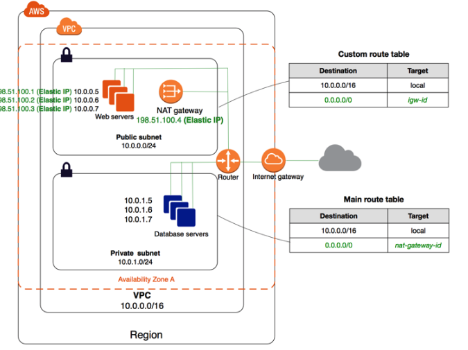

# Lambda VPC 이용과 NAT 연결 설정

- VPC에서 Lambda구성시 인터넷 연결이 끊어지는데, NAT 구성으로 가능함.

- NAT는 `ElasticIP` 설정으로 외부에서는 고정 아이피로 인식 가능함.

----------------------
## 구성 방법

1. Create a new `VPC` like `main-vpc`.
1. Create a new `IGW` (Internet Gateway) for public Internet from inside your VPC.
1. Create a `Public Subnet` like `public-2a/2c`
    - create new `Route Table` like `route-public`.
    - add a new route to route `IGW` from `0.0.0.0/0`
    - assign this route table to `Public Subnets`.
1. Create a new `EIP` (Elastic IP) address like `public-eip`.
1. Create a new `NAT` Gateway like `public-nat`
    - assign it to the `Public Subnets`.
    - assign `Elastic IP` address.
1. Create a `Private Subnet` like `private-2a/2c`
    - create new `Route Table` like `route-private`.
    - add a new route to route to your `NAT` Gateway from `0.0.0.0/0`.
1. Create a `Security Group` like `lemon-services`
    - add in-bound for all traffic from self
1. Create `Endpoints` in VPC for accessing internal AWS
    - create a security group as `infra-services`, and allow all from `lemon-services`
    - add each for `kms`, `sns`, `sqs`, and `execute-api`
        - security-group: `infra-services`
        - subnets: `public-2a/2c`

----------------------
## 구성 예제

Traffic Flow: `private` -> `NAT` -> `IGW` -> Internet

| Type      | Name                  | Description                   | Range                 |
|--         |--                     |--                             |--                     |
| VPC       | `main-vpc`            | Use default VPC               | 172.31.0.0/16         |
| Subnets   | `public-2a`           | Default Route -> IGW          | 172.31.0.0/20         |
| Subnets   | `public-2c`           | Default Route -> IGW          | 172.31.32.0/20        |
| Subnets   | `private-2a`          | Default Route -> NAT          | 172.31.128.0/20       |
| Subnets   | `private-2c`          | Default Route -> NAT          | 172.31.160.0/20       |
| NAT       | `public-nat`          | `xx.xx.xx.xx`                 | -                     |

----------------------
## 구성 테스트하기

- 해당 `private-2a`의 VPC/Subnet 으로 Lambda를 올림
- http request로 인터넷 연결이 되는지 확인 (see `lemon-oauth-api`)
- 필요시 `VPC Endpoint` 구성 필요.
- HTTP: `$ http https://<some-endpoint>.execute-api.ap-northeast-2.amazonaws.com/dev/hello/axios`

